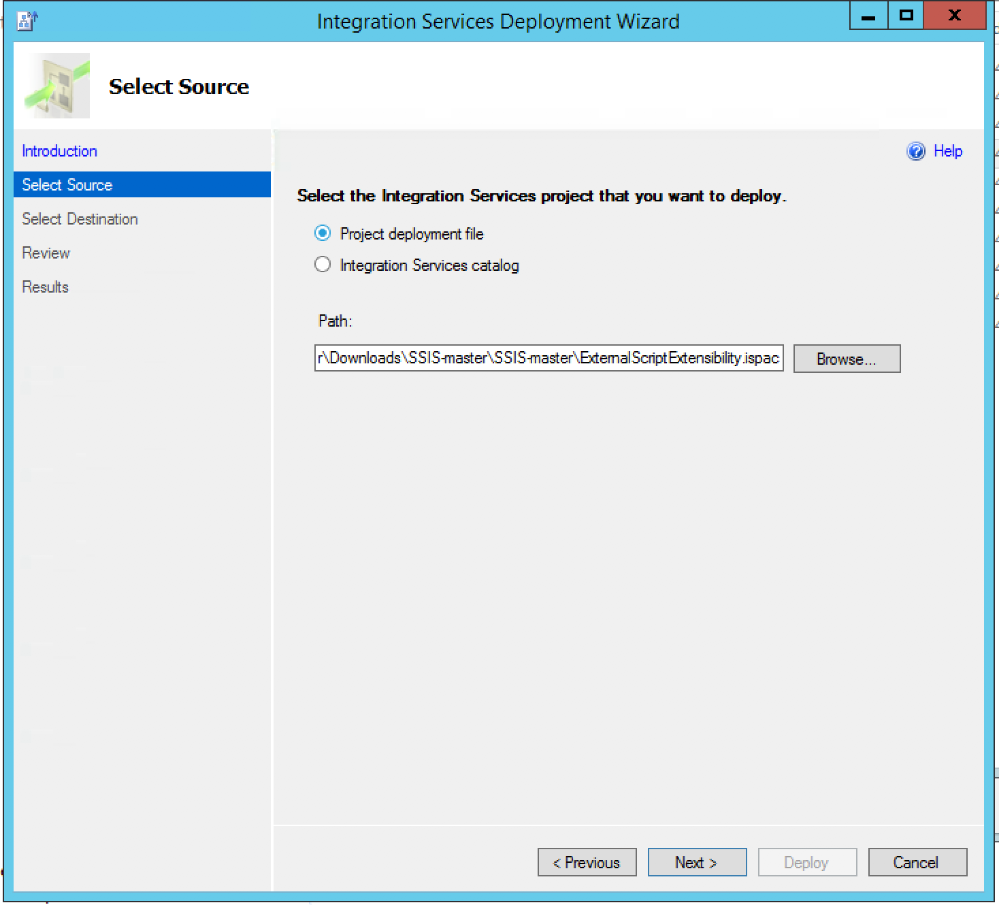
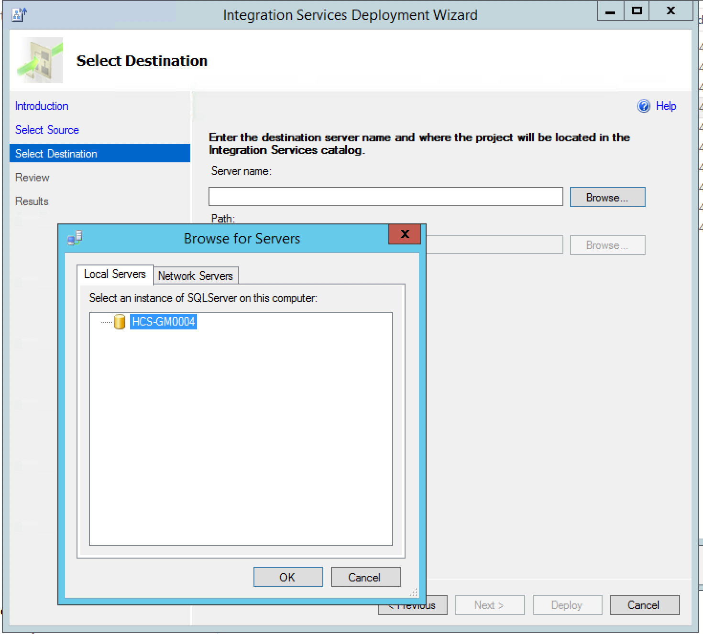
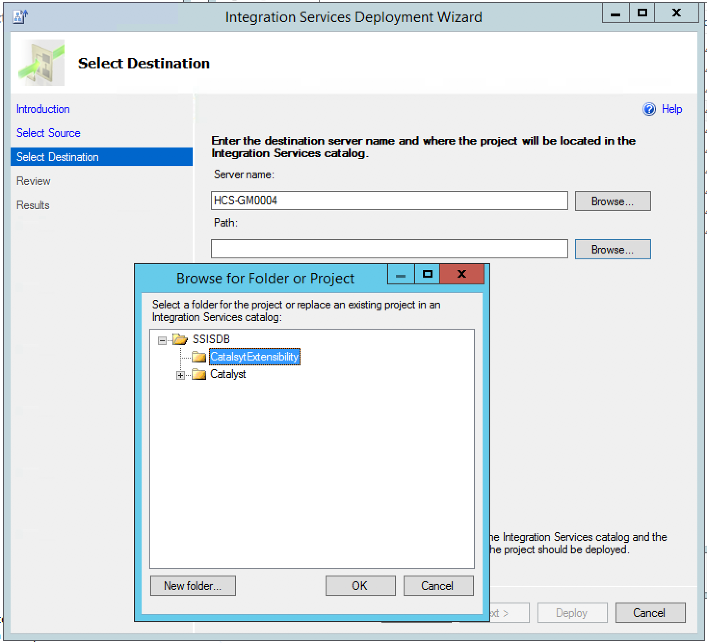
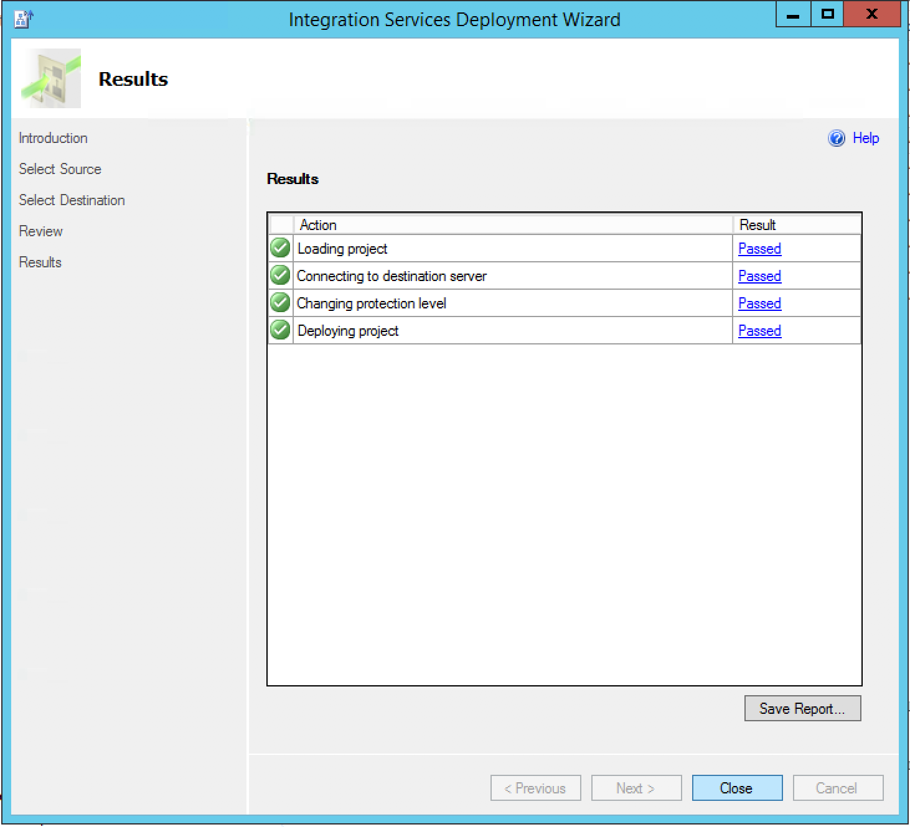
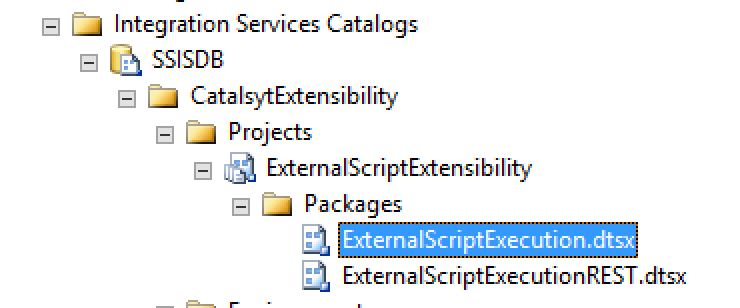

# Machine Learning :: R Extensibility Instructions
- [Initial Steps](#initial-steps)
- [Repeatable Steps For Each Data Mart](#repeatable-steps-for-each-data-mart)
- [Repeatable Steps For Each Destination Entity](#repeatable-steps-for-each-destination-entity)
- [Seed Script Tempaltes](#seed-script-templates)

 
This document instructs the user how to integrate their designated R/Python scripts into the Catalyst loaders.
It begins by installing the required SSIS package and defining new system level attributes. It continues by injecting the new SSIS package into the designated loader step. It concludes by defining the necessary variables for each destination entity.

## Overview
This extensibility point exists to solve the following problems/constraints:
- Typically no file system access is given on the ETL machines. This is required to run an R/Python script with current infrastructure.
- This extensibility point takes an R script stored in a field in the EDW, writes it to a file in the staging folder, executes that file with the correct interpreter, and cleans the file up.
- The extensibility point also coordinates bindings within SAMD so that predictions occur in the right order with other SAMs.

## ML Model Script Verification
Before installing the extensibility points, verify that the user's R/Python scripts run standalone on the desired machine.
Due to the complexity of the extensibility process, **verifying this now avoids confusion later and reduces debugging time.** Only then should a user proceed to set up the extensibility points.

### Things to Look For
- Verify that the R/Python interpreter is installed correctly.
- Verify that all needed libraries are installed, including [healthcareai](https://github.com/HealthCatalyst/healthcareai-r).

### Suggested Verification Process Before Installing Extensibility

1. Verify the R script runs in RGui on the ETL Server
    1. Work in RGui (since other IDEs aren't supposed to reside on ETL Servers)
    2. Install healthcare.ai; **Verify that you're installing the same version as used when training the model**; see [here](https://github.com/HealthCatalyst/healthcareai-r/releases) for older versions
    2. Verify that your script works as anticipated (i.e., you can push predictions to the desired table)
2. Check that the R.exe has been added to path
    1. Open PowerShell and see if the R.exe is in your PATH by typing `R`
    2. If R cannot be found, add it to path via [these instructions](http://www.itprotoday.com/management-mobility/how-can-i-add-new-folder-my-system-path); note: this might be `C:\Program Files\R\R-3.4.4\bin `      
    3. Reopen PowerShell and see that `R` starts without errors by typing `R.exe`
3. Verify the R script runs via PowerShell
    1. Install R packages (i.e., healthcareai) and then exit R via `quit()`
    2. Test your script using `RScript <PATH\YOUR_SCRIPT_NAME>` and make sure that predictions are inserted into the database
      - *If you need a SQL output table schema*, look in the healthcareai docs by typing `?RandomForestDeployment` in R
    3. Verify that a log was created with output from the user script.
    4. Delete the logs that were created.
4. At this point the underlying script and its associated environment and libraries have been verified. Proceed to the extensibility point setup below.

## Installing the Extensibility Packages From an ISPAC File
The following steps are for the .ispac installation wizard.

1. [Download](https://github.com/HealthCatalyst/SSIS/blob/master/ExternalScriptExtensibility.ispac), unzip, and open the .ispac file

2. Select `Project Deployment File` (Note: you can ignore warning about XML node)


3. Select the desired server


4. Create the folder `CatalsytExtensibility` if it does not exist on the database server


5. Cick `Next` and then `Deploy` and ensure that all results passed.


6. Open SSMS and verify that these packages were installed:


## Extensibility Point Configuration
1. Establish local folder on the ETL server. This is the working directory that the user script will run in. *Ideally, have the client DBA configure it as a shared folder that the analyst (i.e., model developer) can read and write to.*
2. Determine Identity of EDW_Loader account;
   1. In SSMS, look under Security -> Credentials -> Double click on credential roughly called EDW Loader
   2. Look at and note the account listed in the `Identity` field
3. Configure permissions to allow that same `EDW Loader` user account to read, write, and execute in this directory.
   1. Right click on the folder with the R script
   2. Select `Security` -> `Edit`
   3. Add permissions to the EDW_Loader account that you identified above
4. Set permissions for SSIS packages installed above. To find existing extensibility points look in: SSMS > Integration Services Catalog > SSISDB > CatalystExtensibility > Projects
    1. Download ETL User Guide for your version of DOS. Here is v3.2 and v4.0
    2. Look for `Extensibility` chapter and the section called `Set up permissions for SSIS packages`
    3. Follow instructions to verify permission to allow the `EDW loader` user account to execute.
5. Under the `Packages` folder, find the `ExternalScriptExecution.dtsx` package, click `Configure` and set the  `StagingDirectory` parameter with the local folder path (where your R script lives), that was discussed above.

## Define Attributes in EDWAdmin
1. Seed three new attribute (`RInterpreterPath`, `ExternalScriptType`, `ExternalRScript`) names into `EDWAdmin.CatalystAdmin.AttributeBASE`. This table can be thought of as a set of keys where values of that key can be set for specific instances of an object elsewhere in `ObjectAttributeBASE`. **Note this SQL can be run as-is. There is no configuration required.**
    
```sql
IF NOT EXISTS
    (SELECT * FROM EDWAdmin.CatalystAdmin.AttributeBASE WHERE AttributeNM = 'RInterpreterPath')
INSERT INTO EDWAdmin.CatalystAdmin.AttributeBASE (AttributeNM, AttributeDSC)
    VALUES ('RInterpreterPath','Local path to RScript.exe')
IF NOT EXISTS
    (SELECT * FROM EDWAdmin.CatalystAdmin.AttributeBASE WHERE AttributeNM = 'ExternalScriptType')
INSERT INTO EDWAdmin.CatalystAdmin.AttributeBASE (AttributeNM, AttributeDSC)
    VALUES ('ExternalScriptType','R or Python')
IF NOT EXISTS
    (SELECT * FROM EDWAdmin.CatalystAdmin.AttributeBASE WHERE AttributeNM = 'ExternalRScript')
INSERT INTO EDWAdmin.CatalystAdmin.AttributeBASE (AttributeNM, AttributeDSC)
    VALUES ('ExternalRScript','R script that contains functions')
```
    
2. Verify that the new Attribute name keys exist in EDWAdmin.
    
```sql
SELECT [AttributeID]
      ,[AttributeNM]
      ,[AttributeDSC]
  FROM [EDWAdmin].[CatalystAdmin].[AttributeBASE]
WHERE AttributeNM IN ('RInterpreterPath', 'ExternalScriptType', 'ExternalRScript')
```
  
## Create an Extensibility Point for Each Data Mart

Seed `EDWAdmin.CatalystAdmin.ETLEngineConfigurationBASE` with these values:
|                Column               |                                          Value                                           |
| ----------------------------------- | ---------------------------------------------------------------------------------------- |
| **ExtensionPointNM**                | `OnPostStageToProdLoad`                                                                  |
| **DatamartID**                      | <DATA_MART_ID>                                                                           |
| **SSISPackagePathOrSPToExecuteTXT** | `\SSISDB\CatalystExtensibility\ExternalScriptExtensibility\ExternalScriptExecution.dtsx` |
| **IsSSISPackageFLG**                | `1`                                                                                      |
| **ExtensionOwnerNM**                | `Health Catalyst`                                                                        |
| **RunInAsyncModeFLG**               | `0`                                                                                      |
| **Use32BitRuntimeFLG**              | `0`                                                                                      |
| **ExecutionOrderNBR**               | `1`                                                                                      |
| **ActiveFLG**                       | `1`                                                                                      |
| **RequiredParametersTXT**           | `BatchID, TableID`                                                                       |
| **FailsBatchFLG**                   | `1`                                                                                      |
The following SQL template needs only a single adjustment of the *DataMartID* before running. This is the DataMartID associated with the SAM where extensibility is being configured.

```sql
INSERT INTO EDWAdmin.CatalystAdmin.ETLEngineConfigurationBASE
(
    ExtensionPointNM, DatamartID, SSISPackagePathOrSPToExecuteTXT, 
    IsSSISPackageFLG, ExtensionOwnerNM, 
    RunInAsynchModeFLG, Use32BitRuntimeFLG, 
    ExecutionOrderNBR, ActiveFLG, RequiredParametersTXT, 
    FailsBatchFLG
) 
VALUES 
(
    'OnPostStageToProdLoad', <DATA_MART_ID>, '\SSISDB\CatalystExtensibility\ExternalScriptExtensibility\ExternalScriptExecution.dtsx', 
    1, 'Health Catalyst', 0, 0, 1, 1, 'BatchID, TableID', 1
)

```
Update your `DataMartID` and verify insertion using this SQL template:
```sql
SELECT * FROM EDWAdmin.CatalystAdmin.ETLEngineConfigurationBASE
WHERE DataMartID = <DATA_MART_ID>;
```
## Repeatable Steps For Each Destination Entity
Before proceeding to this step, ensure that your ML script runs standalone outside the extensibility point workflow. Then, modify the example contained in `healthcareai::start_prod_logs.R` for your use case. The example, below, must be modified in three places.
```
# Object Attribute Base should contain a script like this:
# Move to working directory 
setwd("Prod Server/Machine Learning/MyProject") # Change 1
library(healthcareai)
# Start console logging
start_prod_logs()
# Deploy -------------------------------------------------
# Test deployment. Comment/delete when working
catalyst_test_deploy_in_prod() # Change 2
# Deploy model
# source("myDeployScript.R") # Change 3
# Stop console logging
stop_prod_logs()
```
Changes to the example:
1. Change this to the path of the shared folder on the ETL server.
2. This is a test function to help with the extensibility. 
3. Change this to the filename of your deploy script. It should be called something like: `heart_failure_deploy_v1.R`. 
4. *Later, after verifying that the extensibility works*, comment out the line with change 2 and uncomment the line with change 3.
Once modified, copy the example into the SQL template below, as it is stored _in_ the `ExternalRScript` field.
1.  Seed following new destination entity attribute values into `EDWAdmin.CatalystAdmin.ObjectAttributeBASE` using the SQL template below. Be sure to adjust the values of the TableID ( = Destination Entity of output).
    |             Column             |                                Value                                |
    | ------------------------------ | ------------------------------------------------------------------- |
    | **ExternalScriptType**         | `R`                                                                 |
    | **ExternalRScript**            | {entire contents of the R script example with only double quotes}   |
    | **RInterpreterPath**           | `C:\Program Files\R\R-3.X.X\Rscript.exe`                            |
    ```sql
    INSERT INTO CatalystAdmin.ObjectAttributeBASE
        (ObjectID,ObjectTypeCD,AttributeNM,AttributeTypeCD,AttributeValueTXT)
    VALUES
        (<TableID>,'Table','RInterpreterPath','string','C:\Program Files\R\R-3.X.X\bin\Rscript.exe')
    INSERT INTO CatalystAdmin.ObjectAttributeBASE
        (ObjectID,ObjectTypeCD,AttributeNM,AttributeTypeCD,AttributeValueTXT)
    VALUES
        (<TableID>,'Table','ExternalScriptType','string','R')
    INSERT INTO CatalystAdmin.ObjectAttributeBASE
        (ObjectID,ObjectTypeCD,AttributeNM,AttributeTypeCD,AttributeValueLongTXT)
    VALUES
        (<TableID>,'Table','ExternalRScript','longstring','<ENTIRE_CONTENTS_OF_MODIFIED_EXAMPLE>')
    ```
Verify insertion using this SQL template (edit your `TableID`):
```sql
SELECT * FROM CatalystAdmin.ObjectAttributeBASE WHERE ObjectID = <TableID>
```
2.  Configure dependencies based on need
In SAMD, configure the dependencies for the extensibility. The SAMs are loaded serially. From the perspective of SAMD, the extensibility is just another SAM. It must be configured to run in the proper place in the chain. Particularly:
- Which table must finish loading before the R Script can run?
- Which table will the R script write to?
- Which table will begin loading after the R script is done writing to the database?

## ETL Shared Folder Contents
All of the following must be in the shared folder that is local to the ETL server:
- R script that contains the deploy code. Example: `heart_failure_deploy_v1.R`
- R model that was trained for the project. Example: `heart_failure_rmodel_probability_lasso.rda`
- R model info for the project. Example: `heart_failure_rmodel_info_lasso.rda`

## Suggested Verification Process After Installing Extensibility
1. Trigger your extensibility to run the example contained in `healthcareai::start_prod_logs.R` by:
    1. Changing the working directory to the location that the user script will run
    2. Saving the example into the `ExternalRScript` in `EDWAdmin.CatalystAdmin.AttributeBASE`
2. Verify that a log was created with the correct version of healthcareai printed in it.
3. Run the user script the same way by:
    1. Commenting the line containing `catalyst_test_deploy_in_prod`.
    2. Uncommenting the line that says `source("myDeployScript.R")`
    3. Replacing `myDeployScript.R` with the name of of the user script.
4. Verify that a log was created with output from the user script.
5. Delete the logs that were created.
6. At this point the underlying script and its associated environment and libraries have been verified. Proceed to the other notes below.
## Subject Area Mart (SAM) Configuration
Follow these steps in Subject Area Mart Designer (SAMD) to configure your SAM for typical predictive model extensibility as if SAMD is being used as part of the model deployment infrastructure:
- Think of the R script as the SAM binding and the output table as the SAM entity
    - The source entity for the extensibility point should be the entity that serves as the dataset the R scripts pulls from
    - The destination entity for the extensibility point should be the entity that the R script populates/outputs to
- Use SAMD to generate the output table and to create an entry in the metadata
    - This initial metadata entry is essential to being able to reference the R output table in other SAM bindings
    - The binding used to create the output table should return 0 rows while specifying field names and data types
- Create a binding (and entity) in the SAM to handle additional transformation of the model output, if desired
    - This might include limiting predictions to the most recent predictions that we appended to the output table
## Gotchas
- In the R script on Windows paths must use forward slashes `/` because R interprets backslashes as escape characters.
- In the R script there must be no single quotes. They must all be double `"` quotes. Single quotes are escaped in the SQL statement.
## Client Specific Oddities
- Allina
    - Using an old version of the extensibility where `RInterpreterPath` is a system-level variable with ID of 0.
- Multicare
    - The folders were configured with the wrong names, "Extensions" instead of "Extensibility." SQL must be modified accordingly.
## TODO
- Get any insight into non-running SAMD. How do we get a smoke-signal out?
- figure out what that field format is
- run stored proc and find out what type it returns
- debug nodes
- check variables
- add breakpoint
- look at V1 loader
### Possibly Helpful Debugging C# That We May Resort To
```C#
try
{
    string dataProcessingServiceBaseUri = GetDataProcessingServiceBaseUri(discoveryServiceBaseUri);
    RewriteIncrementalQueries(dataProcessingServiceBaseUri, batchExecutionId);
    this.Dts.TaskResult = (int)ScriptResults.Success;
}
catch (Exception exception)
{
    string message =
        string.Format(
            "An error occurred while calling the DPS to rewrite the incremental queries: {0}",
            exception.Message);
    this.Dts.Events.FireError(0, "CallDPS", message, string.Empty, 0);
    this.Dts.TaskResult = (int)ScriptResults.Failure;
```